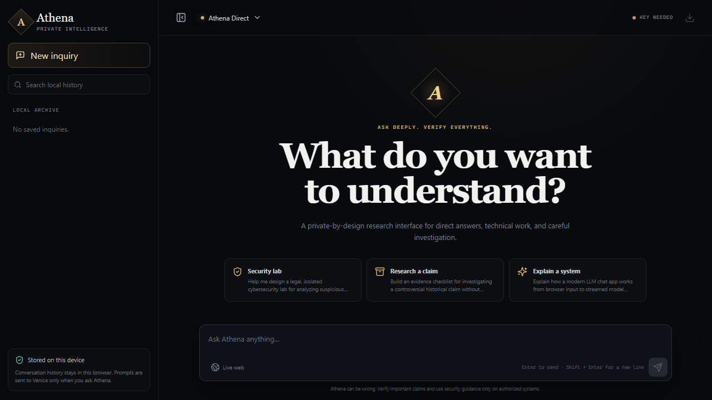
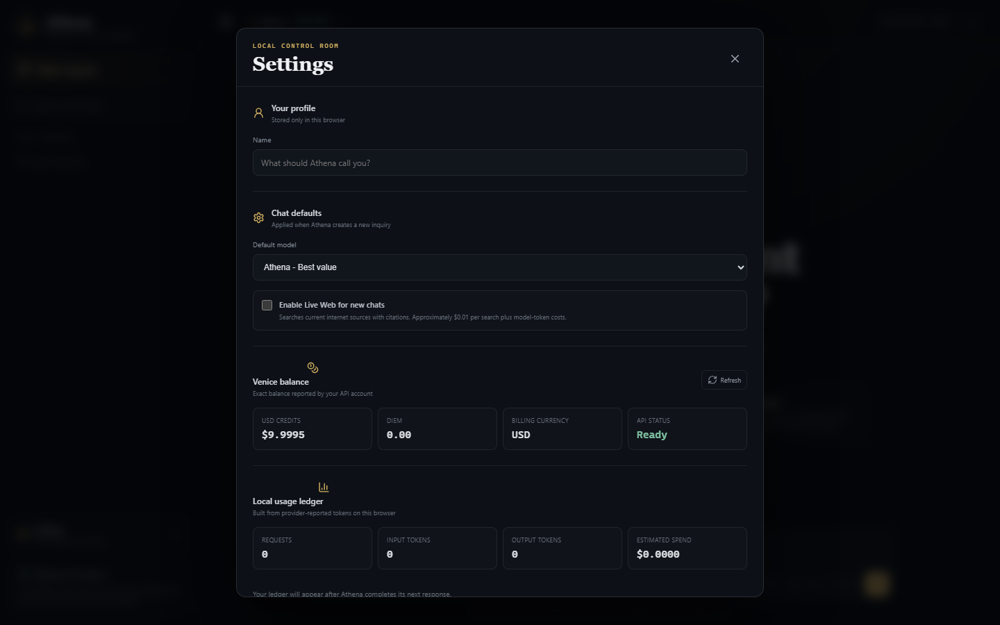

# Athena

Athena is an original, private-by-design AI research interface. It is not a copy of Infinet and does not contain Infinet source code, branding, or assets.





The app provides:

- Streamed LLM responses through the Venice AI API
- Firebase email/password access with session-only login, logout, and in-app password changes
- Gemma 4 Uncensored by default, with optional Qwen power/coding models
- Optional live web grounding and citations
- Conversation history stored in local SQLite on desktop and an AES-GCM encrypted IndexedDB vault in the PWA
- Markdown, tables, and fenced code rendering
- Local uploads for PDFs, Office documents, spreadsheets, text, source code, and images
- Vision analysis with automatic switching away from non-vision models when needed
- In-chat image generation with private general, premium, anime, and adults-only models
- Consent-based reference-photo editing for self portraits, products, scenes, and permitted adult likenesses
- Square, portrait, and landscape compositions with locally stored WebP downloads
- One-click ZIP downloads for complete fenced code files in Athena responses
- Local search, full-data export, copy, stop, and recoverable Trash controls
- A local profile, chat defaults, exact Venice balance, and per-model token ledger
- Starter cards that fill the composer without sending automatically
- A server-side provider proxy so the API key is never shipped to the browser
- An installable iPhone PWA and GitHub Pages deployment workflow

## Run locally

1. Install dependencies:

   ```powershell
   npm install
   ```

2. Copy `.env.example` to `.env` and add a Venice inference API key:

   ```env
   VENICE_API_KEY=your_key_here
   ```

3. Start the development servers:

   ```powershell
   npm run dev
   ```

4. Open <http://localhost:5173>.

Athena now requires the Firebase account described under **Firebase and iPhone setup** below, including for local
development. Authentication is kept in memory, so relaunching or refreshing the app requires another login.

For a production-style run:

```powershell
npm run build
npm start
```

Then open <http://127.0.0.1:8787>.

The production-style address is the recommended personal bookmark. The server binds only to `127.0.0.1`, so it is not exposed to the local network or internet.

To start Athena automatically when you sign in, run this once in PowerShell:

```powershell
.\scripts\Install-AthenaAutostart.ps1
```

The scheduled task runs `scripts/Start-Athena.ps1` in a hidden window, skips startup when port 8787 is already healthy, and retries after failures. Use `scripts/Remove-AthenaAutostart.ps1` to remove it.

## Local data and backups

Athena stores durable data under the project directory:

```text
data/
  athena.db
  attachments/
  backups/
  exports/
  generated-images/
```

Attachments are stored under `data/attachments` so chat history only needs to retain small file references. Each
file can be up to 25 MB, with up to eight files and 50 MB of attachment context in one request. Athena sends an
attached original to Venice only when that message is part of the active conversation path. Removing an attachment
before sending also removes its local copy.

The hosted PWA keeps chat records, prompts, profile settings, generated-image data, and uploaded-file data inside an
AES-GCM encrypted IndexedDB vault. Its master key is randomly generated and wrapped with a PBKDF2-derived password
key; changing the password inside Athena re-wraps that key without exposing it to Firebase. Hosted attachments are
limited to 8 MB each and 20 MB per active request because Cloud Functions request bodies have stricter limits than
the desktop server.

When Athena returns fenced code, a **Download ZIP** action appears below the answer. For reliable project paths,
ask Athena for a ZIP or downloadable project; its system prompt instructs it to label every complete code block with
a relative filename such as `src/App.jsx` or `package.json`.

## Image mode

Open the model picker and choose a model under **Image models**. The composer then changes from chat mode to image
mode: choose Square, Portrait, or Landscape, describe the result, and press Enter. Generated WebP files appear
inline with **Reuse prompt** and **Download image** actions and are retained in `data/generated-images`.

To transform an existing image, click **Reference** in image mode and attach one PNG, JPG, or WebP file. Confirm that
you own the image or have explicit permission to use every depicted person's likeness, then describe what should
change and what should be preserved. The source file stays under `data/attachments`; it is sent to Venice only when
you submit that edit. Do not use reference editing for deceptive impersonation.

Reference edits default to **Original**, which asks the provider to preserve the source aspect ratio, framing,
identity, pose, and unchanged regions. For the best fidelity, write a short edit instruction describing only what
should change rather than restating a complete image-generation prompt. Square, Portrait, and Landscape remain
available when intentional recomposition is desired. Generative editors can still drift from an exact likeness.

Available image modes are Athena Image (fast/general), Athena Imagine, Athena Imagine HQ, Athena Anime, and Athena
Lustify. Lustify requires a one-time adults-only acknowledgement in the browser. The server also requires that
acknowledgement on every Lustify request and rejects prompts involving minors or age-ambiguous subjects. Only use
real adults' likenesses when you have their explicit permission.

`lustify-v8` is a text-to-image model and does not accept source images itself. When Athena Lustify has a reference
attached, Athena transparently uses Venice's private `qwen-edit-uncensored` image-edit model (currently about $0.04
per edit) and labels the result **Athena Lustify Reference**. The per-reference consent confirmation is required in
addition to Lustify's one-time adult acknowledgement.

On the first load after this storage system is installed, Athena imports the existing browser history for that exact address and writes an untouched `browser-import-*.json` backup. It does not clear the browser copy. Normal chat deletion moves a conversation into Trash, and a pre-Trash snapshot is written automatically. Athena also creates daily snapshots and supports manual backup and full JSON export from Settings.

## Firebase and iPhone setup

The Firebase web configuration in `src/firebase.js` is intentionally public; Firebase uses it to identify the
project. The Venice API key and the account password are not stored in the frontend or committed to GitHub.

1. In Firebase Console, open **Authentication → Sign-in method** and enable **Email/Password**.
2. Under **Authentication → Settings → Authorized domains**, add `littleregulus.github.io`.
3. Under **Authentication → Users**, create one user with the internal email `swipingcc@athena.invalid` and the
   desired temporary password. Athena presents the public username `swipingcc`, not this internal email.
4. Upgrade this Firebase project to the Blaze plan before deploying Functions. Cloud Functions deployment requires
   a billing account even when usage remains within the no-cost quota.
5. Store the Venice key in Firebase Secret Manager and deploy the protected API:

   ```powershell
   npm run firebase:secret
   npm run firebase:deploy
   ```

   The first command prompts for the value without putting it in GitHub. The deployed endpoint is
   `https://us-west1-athena-3dd48.cloudfunctions.net/api`.
6. In the GitHub repository, open **Settings → Pages** and select **GitHub Actions** as the source. Pushing `main`
   runs `.github/workflows/deploy-pages.yml`. The workflow uses the endpoint above by default; an optional repository
   variable named `ATHENA_API_BASE_URL` can override it.
7. Open `https://littleregulus.github.io/Athena/` in Safari on the iPhone, tap **Share**, then **Add to Home Screen**.

The project includes Firebase CLI locally, so `npm install -g firebase-tools` is not required. If a password is reset
outside Athena, Firebase can restore account access but cannot decrypt the existing on-device vault. Export a backup
from Settings before an external reset or clear the site data and start a new vault afterward.

## Privacy model

Desktop chat history is written to `data/athena.db`; the browser safety mirror is encrypted in IndexedDB. The hosted
PWA keeps its durable state only in that encrypted device vault. When a message is sent, the active conversation
context and its referenced attachments are transmitted through Athena's authenticated server function to Venice for
inference. Standard private models are not the same thing as cryptographically verified end-to-end encrypted
inference. See [ARCHITECTURE.md](./ARCHITECTURE.md) for the exact distinction.

## Responsible use

Athena is designed for legitimate research, education, creative work, authorized cybersecurity labs, and defensive analysis. You are responsible for having authorization before testing any system.
